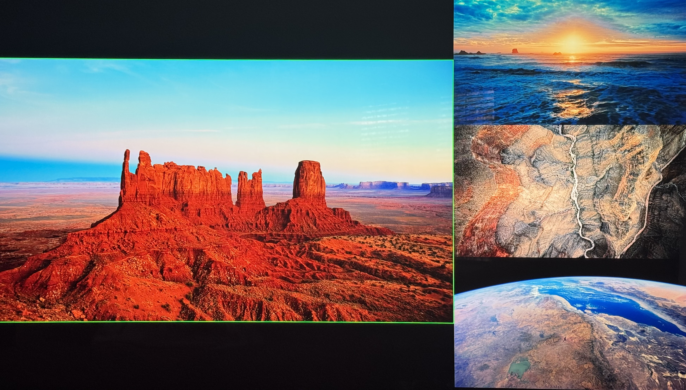
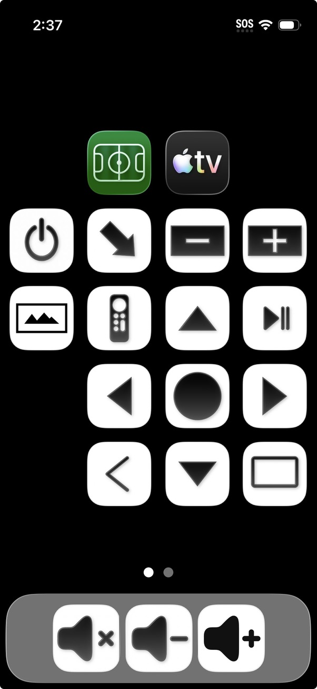

# Overview

This project implements a multiviewer remote control for my home TV. It uses a J-Tech
multiviewer to display four Apple TVs on a single TV, in various layouts. The Apple TVs
can run a mix of streaming apps, which allows multiview within streamers and across
streamers, always with the same user interface and control.  

Here is an example multiviewer layout:



# Architecture

The remote control is an iPhone 13 Mini, which has a home screen with buttons that send
HTTP requests to a daemon written in Python and running on a MacBook. The daemon in turn
controls the J-Tech, the Apple TVs, and soundbar volume. 

# Hardware

- iPhone Mini 13
- MacBook
- 4 Apple TVs
- J-Tech MV41A Multiviewer
- LG S95QR soundbar
- LG TV
- iTach IP2SL, connected to J-Tech
- iTach WF2IR, which sends IR to soundbar

There are manuals for the J-Tech and iTach devices [here](docs/manuals/).

# Remote Control

Here is the remote-control home screen:



The remote control buttons are iOS shortcuts.  Each button is a shortcut that invokes a
shared [main shortcut](remote-control/MV-Do-Command.shortcut) with the button's name
("Home", "Up", "Play_pause", etc).  The main shortcut sends a simple HTTP request to the
daemon with the button name -- all of the multiviewer logic happens in the daemon. For
each button, the [remote-control/](remote-control) directory has a `.shortcut` file and a
`.jpg` file with its icon. From the Shortcuts app, `Add to Home Screen`, and choose the
icon as its image.

# Daemon

The daemon is a few thousand lines of Python, and uses the `asyncio` and `pyatv`
libraries. The [src/multiviewer/](src/multiviewer) directory has all of the code except
for tests. The daemon runs an HTTP server that receives commands from the remote-control
shortcuts, updates its virtual multiviewer state and responds to the request, and then in
the background sends commands to the J-Tech, Apple TVs, and soundbar.

[start-mvd.sh](bin/start-mvd.sh) starts the daemon.  At startup, the new daemon first
kills the prior daemon and then starts a new HTTP server.

# Configuration

[config.py](src/multiviewer/config.py) has host names, IP addresses, and ports.

Currently, the daemon uses a `.pyatv.conf` that lives outside the repo.  That file has
pairing info for the Apple TVs that is required in order for `pyatv` to connect to them.
I plan to move the pairing info into the repo at some point.

# Installation

The project uses a virtual environment to install dependencies and the multiviewer package
(used by tests).  To set up `.venv`, run [setup-venv.sh](bin/setup-venv.sh).

# Testing

The [tests/](tests) directory has end-to-end tests that run the multiviewer through its
commands and check that the J-Tech's screen matches what is expected.

To run all tests:

```sh
python tests/tests.py all
```
