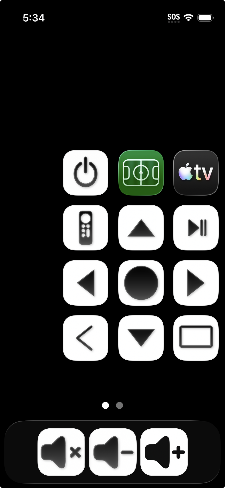

# Remote Control User Guide

The remote control is an iPhone with home-screen buttons that control the multiviewer, the
individual Apple TVs, and the soundbar volume:

# Power

The **Power** button toggles on/off the power of all the hardware in the system, including
Apple TVs, Jtech, soundbar, and TV.

# TV Layouts

The Apple TVs can be arranged on screen in windows of various sizes. There are five window
sizes, relative to TV width: full (1/1), prominent (2/3), medium (1/2), small (1/3), and
pip (1/5). There are eight layouts:

- `FULL`: one full-size window.
- `PIP`: one full-size window and a second pip window, overlayed in a corner.
- `PBP(1)`, `PBP(2)` (picture-by-picture) two windows side by side, vertically centered.
- `TRIPLE(1)`, `TRIPLE(2)`: one window on the left, vertically centered, the other two
  stacked vertically on the right, vertically centered.
- `QUAD(1)`: four medium sized windows in a 2x2 grid.
- `QUAD(2)`: one prominent window on the left, vertically centered, the other three small
  on the right, stacked vertically.

In the `(1)` variants, the windows are all medium size. In the `(2)` variants, the left
window is prominent and the right windows are small.

The `FULL` and `PIP` layouts are _fullscreen_ layouts. The other six are _multiview_
layouts.

In every layout, the windows display distinct TVs.

Here are [ASCII art depictions of the layouts](./window-layouts.md).

# The Selected Window and Selected TV

At all times, one of the displayed windows is the __selected window__, as indicated by a
red or green window border (except if the fullscreen window is selected). All unselected
windows have a gray border. The arrow buttons can be used to select a different window.
The TV in the selected window is the __selected TV__. Audio always comes from the selected
TV. Most remote buttons act on the selected window and/or selected TV.

The **Play/Pause** button toggles whether the selected window's border is distinct
(red/green) from the unselected windows' borders (gray).

# Active TVs

A subset of the TVs are __active__; the other TVs are __inactive__. Only active TVs can be
shown on screen. In multiview layouts, all active TVs are shown. In fullscreen layouts, a
subset of the active TVs are shown.

The **Deactivate TV** button deactivates the selected TV, which hides it offscreen.

The **Activate TV** button activates an inactive TV. In multiview this makes the newly
active TV visible; in fullscreen it is not visible, but is available for selection.

# Screensaver

The **Screensaver** button starts the screensaver on the selected Apple TV.

# Volume

The bottom row of buttons (**Mute**, **Volume Up**, **Volume Down**) control the soundbar
volume. Mute is shared across all TVs. There is a different volume setting for each TV.
**Volume Up** and **Volume Down** change the volume setting of the selected TV. The
multiviewer automatically adjusts the soundbar volume to match the selected TV, including
when unmuting or when changing the selected TV.

# Apple TV Remote

The **Remote** button toggles the remote so that it can act as as an Apple TV remote or as
a multiviewer remote. When the remote control is acting as an `Apple TV` remote for the
selected TV, that TV's window border is red, and the eight keypad buttons (**Up**,
**Down**, **Left**, **Right**, **Select**, **Back**, **TV**, **Play/Pause**) send the
corresponding command to the selected Apple TV.

Double tapping **Remote** brings up the iOS Remote app for the selected TV.

# Multiview Layouts (PBP, TRIPLE, QUAD)

In multiview layouts, the arrow buttons change the selected window to the window the arrow
points to. Double tapping an arrow swaps the selected TV with the TV in the window the
arrow points to. For both single tap and double tap, if the arrow doesn't point to a
window, then nothing happens.

**Select** makes the selected TV fullscreen; from there, **Back** returns to multiview.

The **TV** button togges between the `(1)` and `(2)` layout variants for the active
windows.

# Fullscreen

The **Back** button returns to multiview.

The **TV** button toggles visibility of a PIP (picture-in-picture) window.

If there is no PIP window, then **Right** and **Left** cycle the fullscreen window through
the active TVs.

If there a PIP window, then **Right** and **Left** cycle the PIP window through the active
TVs except the fullscreen TV. **Select** swaps the TVs shown in the PIP and fullscreen
windows. Pressing **Up** or **Down** toward the PIP window selects it, and pressing
**Down** or **Up** the other direction selects the fullscreen window. Double tapping
arrows moves the PIP window around the corners. Each TV can have its PIP window in a
different location.
